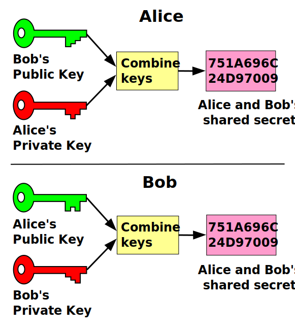

% Cryptography 101
% Michał Zając

# About cryptography

## Definition

>Cryptography is the practice and study of techniques for secure communication in the presence of third parties called adversaries.

-- Wikipedia

## Assumptions

Parties in communication will be called Alice and Bob. Any eavesdropper will be called Eve.

## Security by obscurity

>A cryptosystem should be secure even if everything about the system, except the key, is public knowledge.

-- Auguste Kerckhoffs, 1883

# Early cryptography

## Transposition cipher

```
W . . . E . . . C . . . R . . . L . . . T . . . E
. E . R . D . S . O . E . E . F . E . A . O . C .
. . A . . . I . . . V . . . D . . . E . . . N . .
```

## Substitution cipher

```
To get to the other side!
Gb trg gb gur bgure fvqr!
```

# Modern cryptography

## Symmetric key cryptography

The same key is used for both encryption and decryption. This is a shared secret.

## Symmetric key cryptography

{.stretch}\ 

## Where do I use this?

SSL, TLS, WiFi, [Facebook Messenger](https://fbnewsroomus.files.wordpress.com/2016/07/secret_conversations_whitepaper-1.pdf), [Signal](https://en.wikipedia.org/wiki/Signal_Protocol)

## How do I give someone my key?

Well, fuck. Enter Diffie-Hellman-Merkle key exchange.

## Diffie-Hellman-Merkle key exchange

{.stretch}\ 

## Asymmetric key cryptography

Everyone has two keys: private key and public key.

## Encryption

{.stretch}\ 

## Secret sharing

{.stretch}\ 

## Signing

{.stretch}\ 

## Where do I use this?

Email, SSH, SSL, TLS

## How do I give someone my key?

Send your public key in any way you want. Make sure you don't fuck up and post your [private key](http://crypto.2012.rump.cr.yp.to/87d4905b6d2fbc6ad2389debb73f7035.pdf).

# Key takeaways

##

1. Use ROT-13 for spoilers.
2. Use symmetric cryptography when speed is an issue.
3. Use asymmetric cryptography where privacy is a concern.
4. When using asymmetric cryptography - DO NOT SHARE YOUR PRIVATE KEY.
5. Don't fuck a duck.

## Questions?

## See you on Cryptography 201
